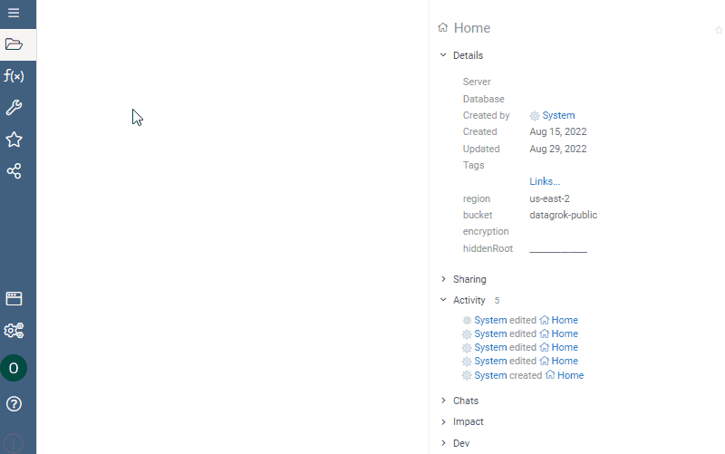

# Databases

In this article:

* [Data access](databases.md/#accessing-databases)
* [Queries](databases.md/#queries)
* [Managing database connections](databases.md/#managing-database-connections)
* [Managing content within a database
  connection](databases.md/#managing-file-shares)
* [Sharing content](databases.md/#sharing-content)

## Accessing databases

Datagrok lets you access databases in a secure and manageable way.

> Key concept: _database connection_
>
> _Database connection_ is a named connection to the database you access with
> Datagrok. The platform can create a _database connection_ to all the popular
> databases, including PostgreSQL, MySQL, MS SQL, Maria DB, Oracle, and others.
> When you use Datagrok, you don’t need to know a physical location or details
> about the database. You only need a _database connection_ name. A _database
> connection_ allows authorized users to access and query databases.
>
>_Connections_ are Datagrok [entities](../datagrok/objects.md), which means they
>can also be used for sharing data with others and for enabling discovery by
>other Datagrok users.

### Supported connectors

Out-of-the-box, Datagrok provides connectors to the following databases:
Microsoft  Access, Amazon Athena, Google BigQuery, Apache Cassandra, IBM DB2,
Denodo, FirebirdSQL, Apache HBase, Apache Hive, Apache Hive2, Apache Impala,
MariaDB, MongoDB, MS SQL, MySql, Neo4j, OData, Oracle Database, and the others.
For the full list of supported connectors and required parameters, see
[Supported connectors]( connectors/supported-connectors.md).

> Developers: You can also extend the platfrom by [creating custom
> connectors](https://github.com/datagrok-ai/public/tree/master/connectors).

### Connect a database

To connect a database, follow these steps:

1. From the main menu on the left, click **Data** > **Databases**.
1. Open the **Add new connection** dialog by either: (1) expanding the
   **Actions** panel and clicking **Add new connection…**, or (2) Rightclicking
   on the appropriate connector in the tree, and choosing **Add connection…**.
1. From the **Data Source** dropdown list, select the desired database if
   needed. This updates the dialog with connection-specific parameter fields.
1. Fill in all dialog fields displayed.

>Notes:
>
> If the connection requires a custom JDBC connection string fill in the
> parameter **Conn. string**. In this case, you don’t need to fill in other
> parameters except for **Login** and **Password**.
>
>You can enter _credentials_ (typically, login/password) manually. When enetered
>manually, Datagrok stores secrets in a secure [privilege management
>system](/govern/security.md/#credentials). You can also set up connection using
>Datagrok's integration with the AWS Secrets Manager (see [Secrets
>Managers](/access/data-connection-credentials.md/#secrets-managers) for
>details).
>
>To define who can change the connection credentials, make a selection from the
>**Credential owner** dropdown.

1. Click **TEST** to the connection, then click **OK** to save it.

## Queries

* [Querying a database](databases.md/#querying-a-database):
  * Write SQL query in [**Query View**](databases.md/#query-view)
  * Aggregate table columns and rows in [**Visual
    query**](databases.md/#visual-query)
  * Join tables in [**Query Builder**](databases.md/#query-builder)
* [Parametrize query](databases.md/#parameterize-a-query)
* [Postprocess query results](databases.md/#postprocess-query-results)

### Querying a database

When the database connection is set, you can start querying the database. You
can get all data or the first 100 rows from a table or use built-in tools to
create more sophisticated queries.

Click the table and use the following actions from (1) the table context menu,
(2) the **Action** tab of the **Property pane**, or (3) the table drop-down menu
on  the **Property pane** :

* **Get All** to retrieve all the data from the table to a dataframe in the
  workspace

  >Note: Depending on the table size, it might take a lot of time and memory.

* **Get TOP 100** to retrieve the first 100 rows of the selected table to a
  dataframe in the workspace
* **New SQL Query…** to start writing a SQL query against this table in **Query
  View**
* **Build Query…** to join this table with the others in this schema
* **Visual Query…** to visually edit the query against this table

GIF

#### Query View

#### Visual Query

Use the standard data aggregation tool to visually query datasets that reside in
a database. Note that the actual data aggregation is performed on a server. This
feature is supported for all relational data connectors. Use the custom
aggregation function for each DB (open source Connectors). The types of
aggregations that the data provider exposes are picked up by DG’s UI such that
you see an option to aggregate by that function if you’re using that data
provider

GIF

#### Query Builder

Use **Query Builder** to build a query for multiple tables using visual
interface

GIF

### Parameterize a query

### Save query

Two options to save a query:

* Save as SQL query (can modify and introduce parameters)
* Save query results as dataframe to the workspace

### Postprocess query results

## Managing database connections

## Managing content within a database connection

## Sharing content

See also:

## Resources
