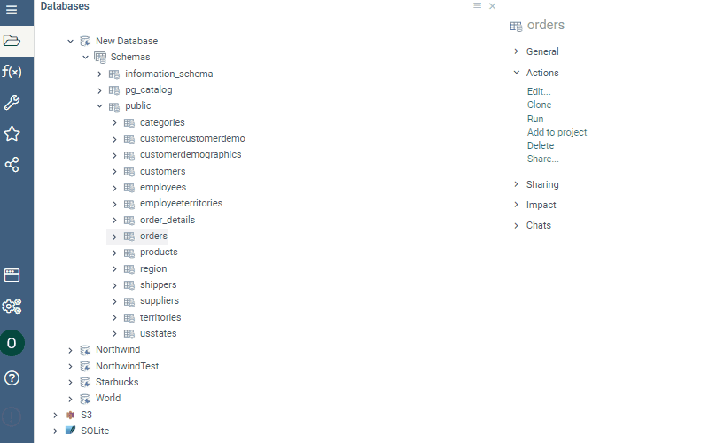
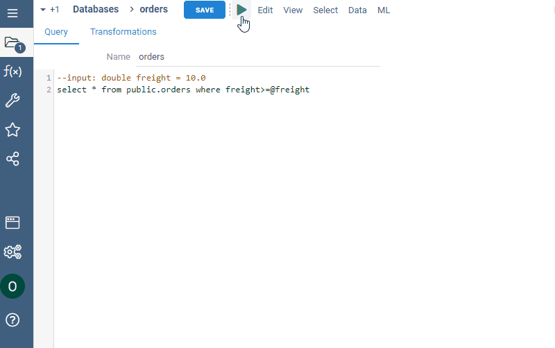
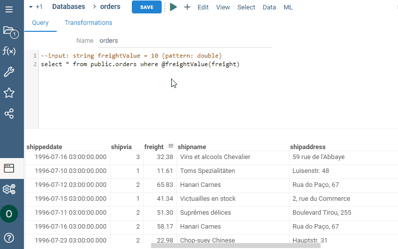
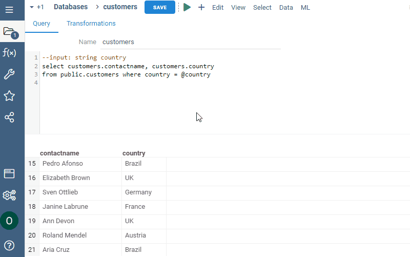

# Databases

Database Manager lets you connect databases and work with them on your system
from the convenience of your web browser. To open Database Manager, from the
main menu, select **Data** > **Databases**.

In this article:

* [Data access](databases.md/#accessing-databases)
* [Queries](databases.md/#queries)
* [Sharing database connections and
  queries](databases.md/#sharing-database-connections-and-queries)
* [Manage shares](databases.md/#manage-shares)
* [Managing database connections and
  queries](databases.md/#managing-database-connections-and-queries)
* [Customizations](databases.md/#customizations)
* [Automation](databases.md/#automation)

## Accessing databases

Datagrok lets you access databases in a secure and manageable way.

> Key concept: _database connection_
>
> _Database connection_ is a named connection to the database you access with
> Datagrok. The platform can create a _database connection_ to all the popular
> databases, including PostgreSQL, MySQL, MS SQL, Maria DB, Oracle, and others.
> A _database connection_ allows authorized users to access and query databases.
>
> _Database connections_ are Datagrok [entities](../datagrok/objects.md), which
> means you can perform a standard set of operations against them (for example,
> annotate, set access privileges, [use in automation
> workflows](data-pipeline.md), or enable discovery by other Datagrok users).
>
> Note: For enterprise users, the Datagrok administrator defines which database
> connections you can access and which privileges you have in them.

### Supported connectors

Out-of-the-box, Datagrok provides 30+ connectors to the major databases. For the
full list of supported connectors and required parameters, see [Supported
connectors]( connectors/supported-connectors.md).

> Developers: You can also extend the platform by [creating custom
> connectors](https://github.com/datagrok-ai/public/tree/master/connectors).

### Add new database connection

To add a database connection, follow these steps:

1. From the main menu on the left, click **Data** > **Databases**.
1. Open the **Add new connection** dialog by either: (1) expanding the
   **Actions** panel and clicking **Add new connection…**, or (2) Right-clicking
   the appropriate connector in the tree, and choosing **Add connection…**.
1. From the **Data Source** dropdown list, select the desired database when
   prompted. This action updates the dialog with connection-specific parameter
   fields.
1. Fill in all dialog fields displayed.
   >Notes:
   >
   > If the connection requires a custom JDBC connection string, fill in the
   > parameter **Conn. string**. In this case, you don’t need to fill in other
   > parameters except for **Login** and **Password**.
   >
   >You can enter _credentials_ (typically, login/password) manually. When entered
   >manually, Datagrok stores secrets in a secure [privilege management
   >system](/govern/security.md/#credentials). You can also set up a connection
   >using Datagrok's integration with the AWS Secrets Manager (see [Secrets
   >Managers](/access/data-connection-credentials.md/#secrets-managers) for
   >details).
   >
   >To define who can change the connection credentials, make a selection from the
   >**Credential owner** dropdown.
1. Click **TEST** to the connection, then click **OK** to save it.


### Modify a database connection

You can modify a database connection at any time. To modify a connection:

1. Right-click the connection to open its context menu, then click **Edit...**.
   This action opens the **Edit Connection** dialog.
1. In the **Edit Connection** dialog, change the connection name,  parameters,
   and credentials as needed.
1. Click **TEST** to the connection, then click **OK** to save the changes.

## Queries

* [Query a database](databases.md/#query-a-database):
  * Write a SQL query
  * Create an aggregation query
  * Build a query for multiple tables
* [Parameterize query](databases.md/#parameterize-a-query)
* [Postprocess query results](databases.md/#postprocess-query-results)

### Query a database

Once you create a connection to the database, you can start querying it. To see
a full list of available options, follow these steps:

1. From the main menu on the left, click **Data** > **Databases**. This action
   shows a list of available connectors.
1. Expand the connector and then the database connection from the list of
   connections available to you.
1. Depending on the connector, to access database’s tables,  expand  **Schemas**
   or **Schemas** > **public**.
1. Right-click the table. Alternatively, on the **Property pane**, either click
   the drop-down arrow next to the table name or expand the **Actions** info
   panel.


Subject to your permissions, you can choose to:

* Retrieve all data (**Get All**).
* Retrieve the first 100 rows (**Get TOP 100**).
* [Write a SQL query](databases.md/#write-a-sql-query) (**New SQL Query…**).
* [Aggregate data via query](databases.md/#aggregate-data-via-query) (**Visual
  Query…**).
* [Join tables](databases.md/#join-tables) (**Build Query…**).

#### Write a SQL query

To query a table manually, follow these steps:

1. From the main menu on the left, click **Data** > **Databases**. This action
   shows a list of available connectors.
1. Expand the connector and then the database connection from the list of
   connections available to you.
1. Depending on the connector, to access database’s tables,  expand  **Schemas**
   or **Schemas** > **public**.
1. From the table's context menu, click **New SQL Query…**. The **Query View**
   opens.
1. In the **Query View**, write the SQL query.
1. When finished, optionally edit the query name. Then on the **Menu Ribbon**,
   click **Save** to save the query to the Datagrok server.

#### Aggregate data via query

To aggregate a table data, follow these steps:

1. From the main menu on the left, click **Data** > **Databases**. This action
   shows a list of available connectors.
1. Expand the connector and then the database connection from the list of
   connections available to you.
1. Depending on the connector, to access database’s tables,  expand  **Schemas**
   or **Schemas** > **public**.
1. From the table's context menu, click **Visual Query…**. This action opens the
   **Visual Query** form.
1. To aggregate values of the column, add this column to the **Measures**
   section:

   * Click the **Add an aggregation** icon next to **Measures**. This action
     opens the context menu.
   * In the first row of the context menu, choose the aggregation type.
     >Note: out-of-the-box, the list of aggregation types contains the Datagrok
     >standard aggregation functions and may include custom aggregation
     >functions exposed by the database provider. For example, Datagrok exposes
     >Postrges database GIS (Geo Information System) functions.
   * Choose the column to aggregate. Datagrok automatically shows the result of
     the query in the dataframe below.
      > Note: You can change the aggregation parameter by right-clicking it and
      > selecting the new aggregation type and column.

1. To summarize data by categories and subcategories, group query results by
   corresponding columns’ values. Add these columns to the **Rows** section by
   clicking the **Add column to group the rows on** icon next to  **Rows**.
1. To turn the unique values from one column into multiple columns in the
   output, add this column to the **Columns** section by clicking the **Add
   column to pivot on** icon next to **Columns**.
1. To filter the results, add the column to the **Filters** section by clicking
   the **Add a filter** icon next to **Filters** and define the condition for
   filtering. To write conditions use [Search
   Patterns](../explore/data-search-patterns.md), for example: '>4' or '=US'.
   The result of multiple filtering is an intersection of all conditions'
   results.
1. When finished, optionally edit the query name. Then on the **Menu Ribbon**,
   click **Save** to save the query to the Datagrok server.



#### Join tables

Datagrok detects the schema of the database. When you open a table in **Query
builder**, the platform automatically displays all the tables connected to it by
the foreign keys.

To join tables, follow these steps:

1. From the main menu on the left, click **Data** > **Databases**. This action
   shows a list of available connectors.
1. Expand the connector and then the database connection from the list of
   connections available to you.
1. Depending on the connector, to access database’s tables,  expand  **Schemas**
   or **Schemas** > **public**.
1. From the table's context menu, click the **Build Query…**. This action opens
    a **Query builder** dialog.
1. On the right side of the dialog, select required columns from tables that the
   platform automatically presents for joining. On the left side of the dialog,
   the platform immediately generates a SQL query, which you can edit. Datagrok
   instantaneously shows the results of the query in the dataframe below.

At any stage of building the query, you can continue interrogating its results
by adding them to the workspace. To add the results of the query to the
workspace, follow these steps:

1. At the bottom of the **Query builder** window, click the context menu icon.
1. Click **Add results to workspace**. The results appear in the dataframe in
   the workspace.

To save a query to the Datagrok server, follow these steps:

1. At the bottom of the **Query builder** window, click the context menu icon.
1. Click **Save as query**. This action opens a **Query View** window.
1. Optionally, you can edit the SQL query or the query name.
1. On the **Menu Ribbon**, click **Save**.

GIF

>Developers: You can create queries across multiple data sources by creating
>separate queries, which then should be used in a data job.

### Parameterize a query

Queries are Datagrok [functions](../overview/functions/function.md), which means
they can also be parameterized. For details, see [Function parameters
enhancement](../overview/functions/func-params-enhancement.md).

To create a parametrized query, follow these steps:

1. From the main menu on the left, click **Data** > **Databases**. This action
   shows a list of available connectors.
1. Expand the connector and then the database connection from the list of
   connections available to you.
1. Depending on the connector, to access database’s tables,  expand  **Schemas**
   or **Schemas** > **public**.
1. To create a query, from the table's context menu, click **New SQL Query…**.
   Alternatively, from the database's context menu, click **Add query…**. A
   **Query View** opens.
1. Add parameters in the query header.

>Note: The syntax for defining query parameters is based on
>[scripting](../compute/scripting.md) with additions specific to queries.

To parametrize a query you can add:

* [Input parameters](databases.md/#input-parameters)
* [Output parameters](databases.md/#output-parameters)

#### Input parameters

Using input parameters in Datagrok, you can:

* [Set default parameter value](databases.md/#set-default-parameter-value)
* Use filtering criteria as inputs by [specifying parameter
  patterns](databases.md/#specify-parameter-pattern)
* [Use lists as inputs](databases.md/#use-lists-as-inputs)
* [Define choices and suggestions](databases.md/#define-choices-and-suggestions)
  for a parameter value
* [Reuse input parameters](databases.md/#reuse-input-parameters)

Use the following syntax  for query `input` parameters:

```sql
--input: <type> <name> = <value> {<option>: <value>; ...} [<description>]
```

> Note: To see the list of supported parameter types, see [Supported parameter
types](parameterized-queries.md/#supported-types).

Let's consider an example of using parameters. The following query selects all
rows from the table `orders` where the value of the argument `freight` is
greater than 10:

```sql
select * from public.orders where freight>=10
```

To receive selections with different `freight` values without rewriting the
query each time, parameterize the argument `freight` as follows:

```sql
--input: double freight  
select * from public.orders where freight>=@freight
```

While executing a parameterized query, Datagrok dynamically generates a UI so
you can set different parameter values.


##### Set default parameter value

To set the default parameter value, in the following template for parameters,
specify`<value>`:  

```sql
--input: <type> <name> = <value>
```

In the following example, `10.0` is the default value for parameter ` freight `:

```sql
--input: double freight = 10.0
select * from public.orders where freight>=@freight
```



##### Specify parameter pattern

To use filtering criteria as free text in a parameter input, specify a pattern
for this parameter. For details about using filtering criteria, see [Search
patterns](../explore/data-search-patterns.md).

To specify parameter pattern, use the following syntax:

```sql
--input: string  <patternName> = <defaultValue> {pattern: <columnType>} 
```

 In the dependent query, use the reference `@<patternName>(columnName)` to
 specify a pattern.

The type `string` of `<patternName>` lets you enter free-text filtering criteria
in UI. In the `pattern` option after the `<defaultValue>`, specify the actual
data type.

In the following example, `@freightValue(freight)` transforms into `freight >
200.0` when a value for `freightValue` is specified as `> 200.0`:

```sql
--input: string freightValue = 10.0 {pattern: double}
select * from public.orders where @freightValue(freight)
```



To learn more about filtering criteria for different data types, see [Patterns
summary](parameterized-queries.md/#patterns-summary).

Learn more about parameter patterns from this video: [Parameterized database
queries](https://www.youtube.com/watch?v=sSJp5CXcYKQ).

##### Use lists as inputs

To use lists as inputs to the queries, use the following syntax:

```sql
--input: list<[listElementsType]> <parameterName>
```

Inside the SQL query before `@<parameterName>`, use `= ANY` operator: `=
ANY(@<parameter name>)`. As another option, you can use an operator with an
alternative selection of the comparison type, such as `>= ANY` or `< ANY`.

For example, you can transform a query taking a single `string` parameter for a
country:

```sql
--input: string country
select customers.contactname, customers.country
from public.customers where country = @country
```

into a query taking a comma-separated list of countries:

```sql
--input: list<string> countries
select customers.contactname, customers.country
from public.customers where country = ANY(@countries)
```



Learn more about using the lists feature form this video: [Lists in
parameterized queries](https://www.youtube.com/watch?v=meRAEF7ogtw).

##### Define choices and suggestions

Options for supported types are described in the
[Scripting](../compute/scripting.md) section.

| Option        | Description                                                                       |
|---------------|-----------------------------------------------------------------------------------|
| `choices`     | A comma-separated list of values, a name of the query, or the actual SQL query    |
| `suggestions` | Name of the query to be called to generate suggestion as the user types the value |

Examples of the `choices` and `suggestions` usage for the parameter
`shipCountry` are the following:

```sql
--input: string shipCountry = "France" {choices: ['France', 'Italy', 'Germany']}
--input: string shipCountry = "France" {choices: Query("SELECT DISTINCT shipCountry FROM Orders")}
--input: string shipCountry = "France" {choices: Demo:northwind:countries}
--input: string shipCountry = "France" {suggestions: Demo:northwind:countries}
```

##### Reuse input parameters

It's possible to re-use one or more existing input parameters as values inside
parameters' `choices` queries, for example:

```sql
--input: string firstLetter = "F"
--input: string shipCountry = "France" {choices: Query("SELECT DISTINCT shipCountry FROM Orders WHERE shipCountry LIKE @firstLetter || '%')}
SELECT * FROM Orders WHERE (shipCountry = @shipCountry)
```

This is handy for queries with hierarchical choices, where each following
parameter depends on the previous.

#### Output parameters

By default, the platform returns a query result as a dataframe. If you plan to
obtain a value of a different data type (for instance, in your JavaScript code),
you can explicitly specify it in the output parameter.

For example, in
[Chembl](https://github.com/datagrok-ai/public/tree/master/packages/Chembl)
package, the following query outputs a string of the semantic type `Molecule`:

```sql
--output: string smiles {semType: Molecule}
```

#### Example

The following example is applicable to the database `northwind`. The query
selects all rows from the table `Orders` where:

* `employeeId` by default equals 5, you can set an integer value.
* `shipVia` by default equals 3, you can use filtering criteria for an integer
  parameter.
* `freight` by default equals 10.0, you can set a value of type `double`.
* `shipCountry` by default equals "France", you can choose from the given
  `choices`.
* `shipCity` by default contains r in its name, you can use filtering criteria
  for a parameter of type `string`.
* `freightLess1000` by default is true, you can switch as a boolean value.
* `requiredDate` by default is 1/1/1995, you can set another date.
* `orderDate` by default is after 1/1/1995, you can use filtering criteria for a
  parameter of type `datetime`.

To learn more about filtering criteria for different data types, see [Patterns
summary](parameterized-queries.md/#patterns-summary).

```sql
--name: PostgresqlOrders
--friendlyName: Orders
--connection: PostgreSQLNorthwind
--tags: unit-test
--input: int employeeId = 5
--input: string shipVia = 3 {pattern: int}
--input: double freight = 10.0
--input: string shipCountry = "France" {choices: Query("SELECT DISTINCT shipCountry FROM Orders")}
--input: string shipCity = "contains r" {pattern: string}
--input: bool freightLess1000 = true
--input: datetime requiredDate = "1/1/1995"
--input: string orderDate = "after 1/1/1995" {pattern: datetime}

SELECT * FROM Orders WHERE (employeeId = @employeeId)
    AND (freight >= @freight)
    AND @shipVia(shipVia)
    AND ((freight < 1000) OR NOT @freightLess1000)
    AND (shipCountry = @shipCountry)
    AND @shipCity(shipCity)
    AND @orderDate(orderDate)
    AND (requiredDate >= @requiredDate)
```

GIF

### Postprocess query results

Datagrok supports postprocessing of query results via transformations. The
platform stores all data transformations done via the UI as macros and can
reproduce them.

To start the transformation of query results, open the transformation editor
following these steps:

> Note: If you edit a query in a **Query View** or **Visual Query** form, skip
> to step 5.

1. From the main menu on the left, click **Data** > **Databases**. This action
   shows a list of available connectors.
1. To view a list of available database connections, expand the connector.
1. To see the queries, expand the database connection.
1. From the query's context menu, click **Edit…**. A **Query View** with SQL
   query or **Visual Query** form opens.
1. At the top of the opened form, click **Transformations**. This action opens
   the transformation editor.
   > Note: To get back to the query editor, at the top of the form, click
   > **Query**.

On the left side of the transformation editor, you can see transformation steps.
You can add steps manually and switch between them to view the results on each
step. For each step, you can perform the following actions:

* Create a transformation step by editing the table with UI or choosing the
  function from the right side of the transformation editor.
* Edit transformation function parameters. To see the parameters expand the
  step.
* Delete the transformation step.

On the right side of the transformation editor, you can see a list of functions
applicable to the query results. To find a function easily, on the left of the
function list, use tags. To apply a function to the query result, click it and
fill in the parameters.
> Developers: you can write a script that accepts a table and produces a table
> and use this script as a transformation step.

When finished, to save the transformation, on the **Menu Ribbon**,  click
**Save**.

## Sharing database connections and queries

Share database connections and queries with individual users and groups directly
from the **Database Manager**. You can specify access privileges for each shared
database connection or query. Once the item is shared, it appears in the
recipient's **Database Manager**.

To access the query, users must have access privileges for the database
connection that contains this query.

### Share database connections and queries

When your access privileges allow it, you can share database connections and
queries available to you.

To share an item, do the following:

1. Right-click the item and select **Share…**  from the context menu. This
   action opens the **Share...** dialog.
1. Enter the user or user group you want to share it with.
  
   In the identity/email field, start typing a person’s name, username, email,
   or group name. Pick from the list of the matching identities.

1. From the respective dropdowns, select access privileges. You can select any
   or all of the following options<!--TBU-->:

    * _Can view_: Users can view, open, and run (for queries)
    * _Can edit_: Users can rename and edit
    * _Can delete_: Users can delete
    * _Can share_: Users can reshare with any other user or group.
1. You may also notify the users you share with. If you don’t want to send a
   notification, uncheck the **Send notification** checkbox.

   > Note: To send an email notification, enter the user's email in the
   > identity/email field. The email notification contains a link to the shared
   > item and entered description. If you enter a user or group name, they will
   > be notified via the Datagrok interface.

1. Click **OK** to share. Once shared, the shared item appears in the
   recipient's **Folder Tree**.

GIF

## Manage shares

Subject to your privileges, you can use the **Data Explorer** panel to inspect
and quickly adjust access permissions to database connections and queries, send
comments to those you're sharing with, and more.

1. First, select the database connection or query.
1. Then navigate to **Data Explorer** on the left and expand the **Sharing**
   info panel to see the complete list of users with access and their
   privileges. From here, you can click any user or group to see their profile,
   your conversation history with them, send them a note, and more.
1. Use the buttons provided to share access with more users, revoke access, or
   edit permissions to the shared item.

    >Note: The same actions are available from the context menu.

GIF pending changes in the UI

## Managing database connections and queries

The **Database Manager** lets you perform standard actions with database
connections and queries such as edit, share, delete, etc. To see a complete list
of available actions, right-click the database connection or query.

>Tip: The same list of actions is available from the **Data Explorer** on the
>right under the **Actions** info panel.

Depending on your privileges, certain actions may not be available to you. For
database connections and queries shared with you, contact the _credentials
owner_. If you are a _credentials owner_, contact the _data source_ owner.

## Customizations

Fundamentally, Datagrok is designed as an extensible environment. Datagrok
extensions can customize or enhance any part of Datagrok. You can provide custom
UI, functions, or [cell renderers](../develop/how-to/custom-cell-renderers.md)
for rich preview. You can add new data types and extract organization-specific
metadata. Extensions can add items to the menus and [context
actions](../develop/how-to/context-actions.md), and so much more.

To learn more about extensions, see [Extending and customizing
Datagrok](../develop/extending-and-customizing.md).

## Automation

Any action performed in **Database Manager** is reproducable and can be used in
automation workflows. For example, you can use data preparation pipeline to
define jobs for data ingestion, postprocessing, and transformations.

To learn more about automating workflows usung data preparation pipelines, see
[Data preparation pipeline](data-pipeline.md).

## Resources

See also:

* File shares
* Web services

## Videos

[](https://www.youtube.com/watch?v=dKrCk38A1m8&t=1048s)
