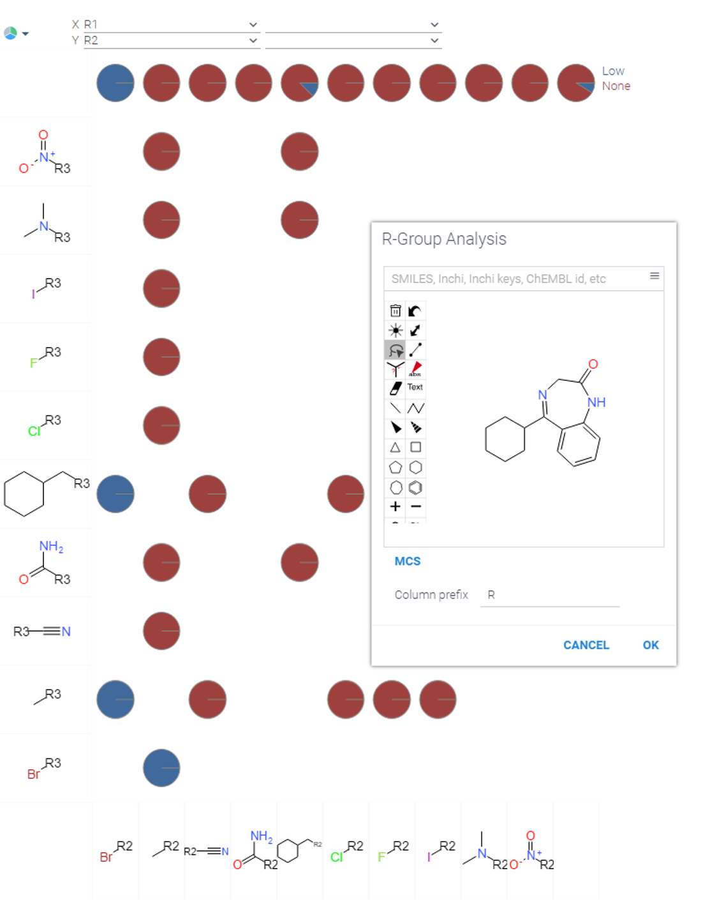
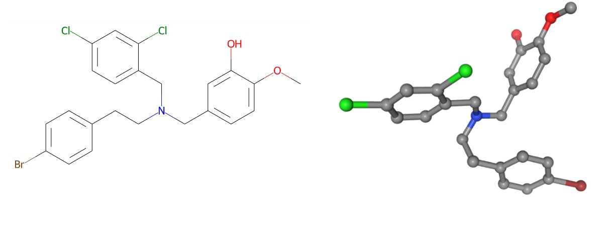
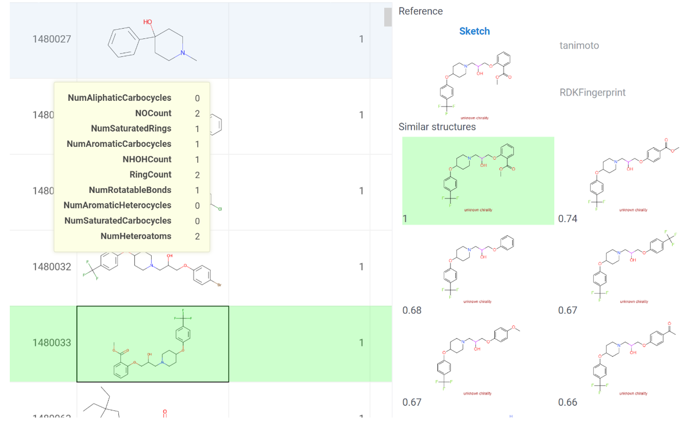
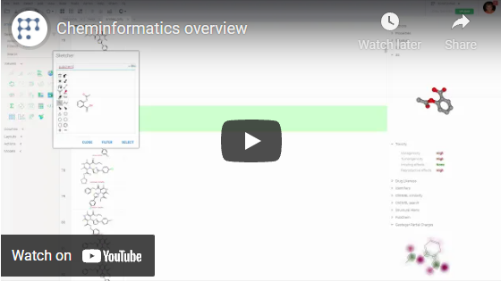

<!-- TITLE: Cheminformatics -->

# Cheminformatics

Datagrok provides a powerful set of tools for [Cheminformatics](https://en.wikipedia.org/wiki/Cheminformatics), accelerating chemically-related workflows.

## Overview

Variant 1:

With Datagrok, you can:
* Instantly import your data of the most common [molecular structure formats](../../access/supported-formats.md#molecular-structure-formats).
  For databases and cloud services we provide [30+ data connectors](../../access/data-connection.md), [data queries](../../access/data-query.md) and [data preparation pipelines](../../access/data-pipeline.md).  
  Our [semantic types](../../discover/semantic-types.md) include molecules, enabling automatic SMILES to structures rendering, chemically-aware viewers and adaptive info panels.

  <GIF с демонстрацией формата SMILES + рендеринг молекул + изменяющиеся инфо панели>
* Visualize your data with context-driven [Viewers](../../visualize/viewers.md). For molecular data, [chemically aware viewers](chemically-aware-viewers) offer additional functionality:
  * Vizualization of the molecules on grid, scatter plot, histogram, trellis plot

    <GIF, показывающая, как выглядят структуры на осях графиков>

  * Synchronized filtering across selected viewers.
  
    <GIF с одновременной фильтрацией на всех вьюерах>
  
  * Datapoint associated tooltip with useful information
  
    <GIF с наведением на датапоинты>

* Accelerate your search,  with [Sketcher](sketcher.md): sketch a new molecule, edit an existing one, or retrieve one by entering compound identifier/trivial name.

  

  You can apply [substructure search](substructure-search-test.md) to your dataset by sketching the substructures to find.
  <GIF с процессом поиска субструктур в молекуле>
  
  While drawing a molecule, info panels update interactively.
  <GIF с обновляющимися инфо-панелями>

* Analyze molecules in [info panels](../../discover/info-panels.md): view structures in 2D and 3D, evaluate [drug likeness](info-panels/drug-likeness.md), [toxicity risks](info-panels/toxicity-risks), [structural alerts](info-panels/structural-alerts.md), chemical properties

* Explore molecules with [diversity search](diversity-search.md) and [similarity search](similarity-search.md)
* Extract [molecular descriptors](descriptors.md) and [fingerprints](fingerprint.md) on the fly
* Train models using [predictive modeling](chem-predictive-modeling.md) and incorporate them in pipelines or [info panels](../../discover/info-panels.md)

<!--  -->
 

Variant 2:

### Import

Instantly import your data of the most common [molecular structure formats](../../access/supported-formats.md#molecular-structure-formats).

> For databases and cloud services we provide [30+ data connectors](../../access/data-connection.md), [data queries](../../access/data-query.md) and [data preparation pipelines](../../access/data-pipeline.md) to access and extract your data seamlessly

With molecules detected, Datagrok plugs in additional functionality: automatic structures rendering, chemically-aware viewers and adaptive info panels.

<GIF с демонстрацией формата SMILES + рендеринг молекул + изменяющиеся инфо панели>

### Visualize

Visualize your data with context-driven [Viewers](../../visualize/viewers.md). For molecular data, [chemically aware viewers](chemically-aware-viewers) extend visual  capabilities and make possible:

* Vizualization of the molecules on grid, scatter plot, histogram, trellis plot

    <GIF, показывающая, как выглядят структуры на осях графиков>

* Synchronized filtering across selected viewers.
  
    <GIF с одновременной фильтрацией на всех вьюерах>
  
* Datapoint associated tooltip with useful information
    <GIF с наведением на датапоинты>

## Augment

Data augmentation helps you extract new information out of your dataset. In cheminformatics the new information may imply rendering molecules in 2D/3D, toxicity scores, drug likeness, partial charges visualization and other. Datagrok's [info panels](../../discover/info-panels.md) collect these and many more molecule-specific features in one place, calculating them on the fly.

In info panels, you can find: (Grok's info panels include:)

* Identifiers - fetches all known identifiers for the specified structure across [UniChem databases](https://www.ebi.ac.uk/unichem/)
* Structure 2D – visualizes a molecule in 2D
* Structure 3D – visualizes a molecule in 3D through generating .mol file
* Molfile – provides a .mol file
* [Gasteiger Partial Charges](functions/gasteiger-charges.md) - visualizes and highlights partial charges in molecule
* [Chem descriptors](descriptors.md) – calculates and displays specified descriptors for a molecule
* Properties – yields the list of calculated or predicted physical and chemical properties: empirical formula, molecular weight, hydrogen bond acceptor (HBA) and donor (HDA) values, LogP and LogS, polar surface area (PSA), number of rotatable bonds and stereocenters, also IUPAC name.
* [Toxicity](info-panels/toxicity-risks.md) –  drug design related feature to predict the toxicity scores. Consists of such categories as mutagenicity, tumorogenicity, irritating effects, reproductive effects.
* [Structural alerts](info-panels/structural-alerts.md) – drug design related feature to highlight fragments in structures that might greatly increase the toxicity and other problematic structural features
* [Drug likeness](info-panels/structural-alerts.md) – drug design related feature to get a score that shows how likely this molecule is to be a drug.

  

In addition to these predefined info panels, users also can develop their own using any scripting language supported by the Datagrok platform.

## Calculate

With chemical dataset uploaded, you can conduct necessary calculations to move along your workflow. In Datagrok, two types of calculations are available: descriptors/fingerprints and mapping functions.

### Descriptors and fingerprints

To vectorize molecular graph data, the platform supports [descriptors](descriptors.md) and [fingerprints](fingerprints.md).

<!-- With fingerprints and descriptors calculated, the following tasks become available: -->
While descriptors are more physical and fingerprints are more abstract vectors, both enable the following procedures:

* Similarity and diversity search
* Chem space dimensionality reduction
* SAR analysis
* Machine learning predictive modeling

Among supported descriptors are Lipinski, Crippen, EState, EState VSA, Fragments, Graph, MolSurf, QED and [others](descriptors.md).

<GIF, высчитывающий fingerprints !!! подождать, пока фингерпринты зальют в top-menu Chem>

Among supported fingerprints are RDKFingerprint, MACCSKeys, AtomPair, TopologicalTorsion, Morgan/Circular and [others](fingerprints.md).

### Mapping functions

Effective management across chemistry data is available only when the same structures are stored under the same identifiers (when the same structures are interlinked across databases)

For each molecule, mapping functions calculate its unique textual identifiers known as [International Chemical Identifiers](https://en.wikipedia.org/wiki/International_Chemical_Identifier).

With just a few clicks, you can convert your structures to InChI and InChI keys, its hashed version.

<GIF c конверсиями>

## Transform

Datagrok lets transform your molecular structures for standartization and/or augmentation purposes.
Beside standard [data wrangling](../../transform/data-wrangling.md) procedures, you can use chemistry-specific ones: curation and mutation.

### Curation

Variant 1:
[Сhemical structure curation](chem-curate.md) standardizes your chemical structures and thereby improves your SAR analysis or your model's prediction accuracy.
Moreover, by chemical structure curation you can avoid data-associated errors such as duplicated vectors in the training set or incorrect structure representation.

Variant 2:
([Сhemical structure curation](chem-curate.md) standardizes your chemical structures and thereby helps avoid data-associated errors such as duplicated vectors in the training set or incorrect structure representation.
By chemical structure curation you can improve your SAR analysis or your model's prediction accuracy.

We offer the following curation methods:

* Kekulization
* Reionization
* Normalization
* Neutralization
* Tautomerization
* Main fragment selection

### Mutation

Mutation function generates new structures based on the specified one. Generation is combinatorial and includes such options as step - number of permutations applied to the structure, and max random result - number of output structures.

<!-- пока про Mutation не стоит писать, ибо функция сыровата --> 

## Search

Оur search functions help to navigate across molecular structures and include the following types:

* ### [Similarity and diversity search](similarity-search.md)

  For the specified structure, finds the 10 most similar/diverse ones in your dataset.
  In similarity search all the found structures are sorted by similarity score  based on Morgan fingerprints and multiple [distance metrics](similarity-spe#available-distance-metrics) to opt.

  

* ### [Substructure search](substructure-search-test.md)

  Searches a specified structural pattern in the datasource.

> Similarity and substructure search support uploaded dataset, public databases (Chembl, PubChem, DrugBank) and [relational databases](db-substructure-similarity-search.md).

<GIF с поиском субструктур в опен-сорсных БД>

> Note: to expand search capabilities, use Sketcher to find sketched substructures in an uploaded dataset or in public databases.

<GIF c поиском с помощью скетчера>

## Analyze

Var 1:
The core of Grok's cheminformatics domain is our analytical toolset. For chemistry-related tasks we offer multiple methods of 2 functional categories:

Var 2:
To handle chemical analysis, Grok's toolset offers multiple methods. Functionally, they fall into 2 categories:

Var 3:
Analytical methods vary. Thus, for easy navigation our analytical toolset falls into two functional categories:

* Analyze SAR - identify bioactivity values based on structure
* Analyze Structure - investigate exclusively structural pecularities

<!-- Leonid: 
* Analyze SAR - methods identifing structure-activity relationshpis
* Analyze Structure - approaches investigating structural pecularities of your dataset -->

### Analyze SAR

* #### [R-group analysis](r-group-analysis.md)

  Identifies R-group branches connected to a scaffold. For comparative visualizations, trellis plot is available.

   - сделать гифку

* Activity Cliffs

  Finds similar compounds with different activity in your dataset.

  Choose similarity percent of neighbors, run the function and explore activity cliffs displayed on 2D plots.

  <GIF с процедурой поиска Activity cliffs>

* Structural Alerts

  Flags potential chemical hazards taken from several rule sets containing
[1,251 substructures in the SMARTS format](https://raw.githubusercontent.com/PatWalters/rd_filters/5f70235b387baa39669f25d95079e5dfec49a47c/rd_filters/data/alert_collection.csv).
  Presence of any of these substructures triggers a structural alert shown on the info panel.

### Analyze Structure

Analyze Structure methods include:

* Chem space

  Explores structural similarity of your molecular data on 2D clusters. For dimensionality reduction, you can choose either t-SNE or UMAP algorithm. Among distance metrics are Cosine, Sokal, Tanimoto, Assimetric.

* Elemental Analysis
  
  Represents molecules as the sum of its constituent atoms with optional radar plots.

  > Make use of elemental analysis while filtering molecules with inappropriate atoms

* Scaffold Tree

  Constructs tree hierarchy based on molecular scaffolds in your dataset. Use the hierarchy for filtering or selecting the corresponding rows in the dataset.
  
## Predict

Datagrok   enables   machine   learning   predictive   models   by   using
chemical properties, descriptors, and fingerprints as features, and the
observed properties as targets. This lets
researchers build predictive models that can be trained, assessed, executed,
reused by other scientists, and used in pipelines.

<Залинковать предиктивные модели на DG, показать в гифках, как их можно использовать>
<Показать, как вставляются нововычисленные значения в info panels>

---
    

### Importing molecular data in Datagrok <!--corr: should it be here?-->

[Import the dataset](../../access/file-browser-and-file-shares.md), as you normally would, by opening a file, querying a
database, connecting to a webservice, or by any other method. The platform is smart enough to automatically recognize
chemical structures.

One might expect planar representations to be the most convenient form for small molecules and use 3D representations
only when conformational properties of molecules are of importance, are which is an everyday situation in such areas
like molecular modelling. Macromolecular representations are also supposed to be 3D.

The generalizations of molecules with varied substitutes or chemical groups, also known as Markush structures, only
describe a scaffold and can have any substitutes in R positions.

These representations can be of great importance for description of monomers of a decomposed macromolecule, or for
description of chemical classes, which is widely used in high throughput screening or umbrella patents. The concept of _
scaffold_ is widely applied in medicinal chemistry. Scaffolds are mostly used to represent core structures of bioactive
compounds. Although the scaffold concept has its limitations and is often viewed differently from a chemical and
computational perspective, it has provided a basis for systematic investigations of molecular cores and building blocks,
going far beyond the consideration of individual compound series. (On scaffolds, also
see [here](functions/murcko-scaffolds.md)).

Datagrok is sharpened to process chemical structures. The platform is smart enough to automatically recognize them, so
Datagrok provides these representations as soon as it detects any molecule-associated type in every entity whether it is
a table, tooltip, any other element.

### Formats for storage of molecular data in cheminformatics

The most vivid representation of molecular structure is _molecular graph_, and Datagrok provides to its users the set of
tools for work with such graphs. <!--corr: Which ones? Examples, please-->  From the viewpoint of mathematics, graphs
are sets of vertices and edges, and can be encoded in different formats.

In order to store comprehensive structural information about a molecule, the MOL file format is widely used (
see [here](http://c4.cabrillo.edu/404/ctfile.pdf) and
[here](https://en.wikipedia.org/wiki/Chemical_table_file#Molfile)). It encodes the information about atoms (vertices),
bonds (edges), and the associated data, such as atom coordinates, charges, isotopes, etc. Multiple MOL files are stored
as an SDF file (see
[here](https://en.wikipedia.org/wiki/Chemical_table_file#SDF)), its feature is the possibility to include any other
additional information (e.g. experimental activity values). Being very convenient, MOL is widely used in the
overwhelming majority of cheminformatics software.

Very similar to MOL is
[PDB notation](https://pdb101.rcsb.org/learn/guide-to-understanding-pdb-data/dealing-with-coordinates), utilized for
macromolecules. The most compact popular format for encoding molecular data is
[SMILES string](https://www.daylight.com/dayhtml/doc/theory/theory.smiles.html). Datagrok uses SMILES to restore MOL
files for subsequent processing. For chemical reactions, the modified strings
of [SMIRKS notation](https://www.daylight.com/dayhtml/doc/theory/theory.smirks.html) are employed.

MOL and SMILES are, perhaps, the best existing formats for storing the structural data for a single molecule. However,
some applications rely upon the idea of _uncertain chemical structures_, like fragments that do not correspond to any
specific molecule. For such purposes, logical expressions become essential,
(e.g. _carbon or oxygen_ atom, _double or aromatic_ bond) and
[SMARTS notation](https://www.daylight.com/dayhtml/doc/theory/theory.smarts.html)
comes in handy with this option. One might say that SMARTS is the "regular expressions of cheminformatics", for this
notation is used to define substructural _patterns_ in molecules.

Datagrok makes use of SMARTS for search of structural alerts, substructure search and R-group analysis.
<!--corr: it is necessary to list here other exapmles of the aforementioned formats in use-->

### Descriptors and fingerprints

Although molecular graph is a useful representation for molecular structure, it is less appropriate for a range of
cheminformatics applications, in particular, machine learning (ML) tasks. For such tasks, molecules can be represented
as a set of _molecular descriptors_ or _molecular fingerprints_. The purpose of these representations is to meet the
linear algebra requirements of the majority of ML methods, namely, provide a vector describing the molecule.

Fingerprints are an abstract representation of molecular structure in the form of binary vectors. They are used in
similarity measures (calculations that quantify the similarity of two molecules), and screening
(a way of rapidly excluding molecules from the set of candidates in a substructure search). Descriptors and fingerprint
have the following properties:

* A variety of different descriptors and fingerprints could be derived from a single molecular graph.
* They are invariant to numberings in a molecule.
* In most cases, they can be interpretated in terms of chemical or physical properties.
* Reactions, mixtures of compounds, nanoparticles could also be represented as descriptors.

Descriptors and fingerprints are frequently used for processing similar chemical structures. These representations are
helpful in similarity search and diversity search. In combination with clustering and self-organizing maps, the methods
like stochastic proximity embedding allow one to reduce the dimensionality of the abstract vector representations, and
to separate the most significant features of the molecule. It helps us to visualize the chemical space in 2D maps in the
problems of molecular data mining, and compound activity prediction.

Datagrok supports generation of different sets of descriptors and fingerprints:

* Lipinski, Crippen, EState, EState VSA, Fragments, Graph, MolSurf, QED. See [molecular descriptors](descriptors.md)
  for more details and a demo about descriptors.

* RDKFingerprint, MACCSKeys, AtomPair, TopologicalTorsion, Morgan/Circular.
  See [molecular fingerprints](fingerprints.md) for more details and a demo about fingerprints.

## Descriptor-based tools

Descriptor representation of molecular structure enables us to consider molecules as points in an abstract
_chemical space_. This space is supposed to have more than 1060 such points, corresponding to actual or
possible molecules, as estimated by Lipinski and Hopkins<!--corr: links?-->. Each molecular dataset defines a chemical
space which could be interpreted as a linear/vector space based on molecular descriptors, which allows to implement the
mechanisms of similarity estimation.<!--corr: revision of
this phrase required-->

### Chemical space maps

The visualization of multidimensional abstract chemical/feature space can be facilitated with the help of 2D projections
of descriptor vectors, or _planar maps_<!--corr: is it a correct term?-->. Such maps reduce the dimensionality of the
initial vector space, and place points/projections closer to each other if they correspond to similar structures, and
farther otherwise, so that the distance between two points on a projection is determined by the similarity of molecules.
This is possible due to the introduction of various metrics (such as
[Tanimoto distance](https://en.wikipedia.org/wiki/Jaccard_index#Tanimoto_similarity_and_distance))
over the feature space. Datagrok has a tool called "Chemical space", that helps researchers to analyze a collection of
molecules in terms of structural similarity. The possibility of choice of descriptors/fingerprints and distance metrics
leads to various planar representations of the explored dataset.

### Similarity search

"Similarity search" is another analytical tool of Datagrok based on descriptors/fingerprints. It allows one to readily
find all molecules that have similar structure and, contrary to chemical space visualization, the similarities are used
here for direct investigation.

Datagrok's "Similarity Search" finds structures similar to the specified one. Options for descriptors/fingerprints and
metrics selection are present to get the desired results.

See [Similarity Search](similarity-search.md) for a demo about this tool.

### Diversity search

Another application of computed similarity measures is to find the most diverse structures in the dataset.
"Diversity Search" tool finds 10 most distinct molecules. These structures can be used to estimate the variety of
chemical classes presented in the dataset. "Similarity search" and "Diversity search" tools can be combined together to
form a collection browser. 'Diverse structures' window shows different classes of compounds present in the dataset; when
you click on a molecule representing a class, similar molecules will be exposed in the 'Similar structures' window.

See [Diversity Search](diversity-search.md) for a demo about this tool.

### Structure-property predictions

Some descriptors have a strong relation to the physical and chemical properties of the molecule. This makes it possible
to derive such properties by means of direct calculations or by employing the quantitative structure-property
relationship (QSPR) models. Datagrok provides the following properties<!--corr: related
to QSPR?--> : formula, drug likeness, acceptor count, donor count, logP, logD, polar surface area, rotatable bond count,
stereo center count. One may develop a custom QSPR model basing upon the provided descriptors/fingerprints and all the
powers of Datagrok machine learning tools.

Learn more about [predictive modeling for cheminformatics](chem-predictive-modeling.md) and a demo of building and
applying a model.

## Molecular graph tools

<!-- Descriptors and fingerprints are handful for various computations, but their application is limited
by a number of specific tasks. Operating with native molecular graphs could benefit in additional insights
and greatly increases the pool of supported tools in Datagrok making it possible to quickly handle and
filter large amounts of chemical data.-->
<!--corr: a very vague formulation-->

### Subgraph tools

Datagrok automatically detects the supported types of chemical notation in order to unveil the structure in each element
possible<!--corr: what element? what structure?-->. It can also handle special chemical queries for subgraphs. This is
apt in filtering of chemical datasets, because a subgraph may not be related to existing structure (e.g. query can have
a single aromatic atom or bond)<!--corr: what?--> . Each time the filter is applied, such a query detects a subgraph in
the structures containing it, and Datagrok highlights queried substructures in the subset after performing the
filtering. Suchlike queries can be drawn in the sketcher or cast as SMARTS strings. Another application of subgraph
analysis is the most common substructure (MCS). MCS problem is of great importance in multiple aspects of
cheminformatics. It has diverse applications ranging from lead prediction to automated reaction mapping and visual
alignment of similar compounds. MCS feature is integrated into several Datagrok tools<!--corr: list!-->, with sketching
options.

### R-groups

<!--corr: this paragraph should be refactored-->
R-Group Analysis is a chemical methodology, which typically involves R-group decomposition, followed by the visual
analysis of the obtained R-groups. This analysis uses the graph of a selected scaffold in order to find all the entries
in the dataset sharing that scaffold, and get all the corresponding substitutes. Datagrok's "Trellis Plot" is a natural
fit for such an analysis.

See [R-group analysis](r-group-analysis.md) for more details and a demo.

### Structure generations

Combination of two subgraphs yields a new graph. Molecule-generating functions in Datagrok are capable of generating
structures based on selected scaffold, thus enriching the chemical space being studied.<!--corr:
examples-->

### Virtual reactions

Not all of the potential chemical structures, that can be obtained from graph models combinatorially, can be synthesized
in real-world reactions. To estimate the possibility and complexity of new structure synthesis, Datagrok makes use of _
virtual synthesis_. This feature consists in applying a specified chemical reaction to a pair of columns containing
molecules. The output table contains a row for each product yielded by the reaction for the given inputs. Each row
contains the product molecule, index information, and the reactant molecules that were involved. Virtual reaction is an
alternative to plain structure generation, because it produces structures that are more likely to exist in reality than
those ones generated combinatorially. In combination with structure generation, virtual reactions enrich the explored
chemical space.

'Do Matrix Expansion': If checked, each reactant 1 will be combined with each reactant 2, yielding the combinatorial
expansion of the reactants. If not checked, reactants 1 and 2 will be combined sequentially, with the longer list
determining the number of output rows.

Corresponding function: #{x.demo:demoscripts:TwoComponentReaction}

See details [here](functions/reactions.md).

## Virtual screening

Perhaps, the most prolific application of cheminformatics is the search of new structures that could be considered as
potential drugs. Here we describe Datagrok's support for virtual screening and special tools intended for this purpose.

See [Chemical dataset curation](chem-curate.md) for more details, and a demo with curation examples.

References:

* [Chemical structures curation in cheminformatics](https://pubs.acs.org/doi/10.1021/ci100176x)

### Filtering driven by biological data

Drug design tasks are essentially related to a wide spectrum of biological issues. Biological aspects restrict the
chemical space that could be used for drug discovery purposes. Datagork provides the following tools to filter the
explored dataset:

* 'Toxicity' - predicts the following toxicity properties: mutagenicity, tumorigenicity, irritating effects,
  reproductive effects.

See details [here](info-panels/toxicity-risks.md)

* 'Drug likeness' - a score that shows how likely this molecule is to be a drug. The score comes with an interpretation
  of how different sub-structure fragments contribute to the score.

See details [here](info-panels/drug-likeness.md)

* 'Structural alerts' - drug specific structural alerts which in most cases could lead to severe toxicity.

See details [here](info-panels/structural-alerts.md)

### QSAR modeling

Pharmaceutical tasks demand the extensive use of cheminformatics methods aimed at exploration analysis of chemical
datasets. The datasets typically come with experimental values (e.g. measured biological activity of a compound). One of
the most common tasks is the evaluation of structure-activity relationships. These relationships play a crucial role in
the process of drug development, because they contribute to hit compound identification and lead compound
optimization. (Q)
SAR<!--corr: what is it?--> studies are performed in order to find possible leads in the screening datasets. In contrast
to physical predictive models, machine learning predictive models do not have any intrinsic knowledge about the physical
and biological processes. Instead, they rely on techniques like random forest or deep learning to predict chemical,
biological and physical properties of novel compounds on the basis of empirical observations of small molecules.

Datagrok supports machine learning [predictive models](../../learn/data-science.md#predictive-modeling), which take
chemical
[properties, descriptors, and fingerprints](#descriptors-and-fingerprints)
as features, and the observable properties as the predicted outcomes. It lets researchers build models that can be
trained, assessed, executed, reused by other scientists, and included in pipelines.

Learn more about [predictive modeling for cheminformatics](chem-predictive-modeling.md) and a demo of building and
applying a model.

References:

* [Machine learning in chemoinformatics and drug discovery](https://www.sciencedirect.com/science/article/pii/S1359644617304695)

### What chemical space to screen?

The developed model<!--corr: which one??--> is able to get the possible hits from the screened dataset but one of the
most important tasks is to ensure that the screened set satisfies the screening needs. The described above tools can
highly enrich the screening dataset with the generation of structures and performing the virtual reactions.
Additionally, Datagrok provides access to freely available databases. DrugBank structures are available to search the
potent hit among existing drugs for drug repurposing aims. Data from ChEMBL and PubChem could also be accessed to
analyze structure from different biochemical and phenotypic assays as well as collections of synthesizable compounds.

## Sum of technologies

### Visualizations and convenience

#### Chemically-aware viewers

Many viewers, such as
[grid](chemically-aware-viewers.md#grid),
[scatter plot](chemically-aware-viewers.md#scatter-plot),
[network diagram](chemically-aware-viewers.md#network-diagram),
[tile viewer](chemically-aware-viewers.md#tile-viewer),
[bar chart](chemically-aware-viewers.md#bar-chart), form viewer, and
[trellis plot](chemically-aware-viewers.md#trellis-plot)
will recognize and render chemical structures.

#### Molecule sketcher

Sketch a molecule using the built-in editor, or retrieve one by entering a compound identifier. The following compound
identifiers are natively understood since they have a prefix that uniquely identifies source system:
SMILES, InChI, InChIKey, CHEMBL, MCULE, comptox, and zinc. The rest of the 30+ identifier systems can be referenced by
prefixing source name followed by colon to the identifier, i.e. 'pubchem:11122'.

#### Molecule identifier conversions

Grok lets users easily and efficiently convert molecule identifiers between different source systems, including
proprietary company identifiers.

Supported sources are:
chembl, pdb, drugbank, pubchem_dotf, gtopdb, ibm, kegg_ligand, zinc, nih_ncc, emolecules, atlas, chebi, fdasrs,
surechembl, pubchem_tpharma, pubchem, recon, molport, bindingdb, nikkaji, comptox, lipidmaps, carotenoiddb,
metabolights, brenda, pharmgkb, hmdb, nmrshiftdb2, lincs, chemicalbook, selleck, mcule, actor, drugcentral, rhea

To map the whole column containing identifiers, use #{x.ChemMapIdentifiers} function.

IUPAC name is located in the "Properties" panel.

In order to retrieve a single structure by an identifier, it might be handy to use
[Sketcher](sketcher.md)

### Technologies integrated

#### In-memory substructure search

To search for molecules within the table that contain specified substructure, click on the molecule column, and press
Ctrl+F. To add a substructure filter to [column filters](../../visualize/viewers/filters.md), click on the '☰' icon on
top of the filters, and select the molecular column under the 'Add column filter' submenu.

#### Most common substructure

The maximum common substructure (MCS) problem is of great importance in multiple aspects of cheminformatics. It has
diverse applications ranging from lead prediction to automated reaction mapping and visual alignment of similar
compounds.

To find MCS for the column with molecules, run `Chem | Find MCS` command from column's context menu. To execute it from
the console, use `chem:findMCS(tableName, columnName)` command.

#### Accessing cheminformatics tools for a single molecule

Chemical intelligence tools are natively integrated into the platform, so in most cases the appropriate functionality is
automatically presented based on the user actions and context. For instance, when user clicks on a molecule, it becomes
a current object, and its properties are shown in the
[property panel](../../datagrok/navigation.md#properties). Click on a molecule to select it as a current object. This
will bring up this molecule's properties to the property panel. The following panels are part of the 'chem' plugin:

* Identifiers - all known identifiers for the specified structure (UniChem)
* Molfile – get a specified molecule .mol file
* Structure 2D – gets a planar molecular representation
* Structure 3D – gets a 3 dimensional molecular representation
* Gasteiger Partial Charges – use it to get a representation with partial charges highlight
* Chem descriptors – get the specified descriptors for a structure
* Properties – get a list of calculated or predicted physical and chemical properties
* Toxicity – drug design related feature to predict the toxicity
* Structural alerts – drug design related feature to highlight fragments in structures that might greatly increase the
  toxicity and other problematic structural features
* Drug likeness – drug design related feature to get a score that shows how likely this molecule is to be a drug. The
  score comes with an interpretation of how different sub-structure fragments contribute to the score.

In addition to these predefined info panels, users can develop their own using any
[scripting language](../../compute/scripting.md)
supported by the Grok platform. For example,`#{x.demo:demoscripts:GasteigerPartialCharges}`.

#### Accessing cheminformatics tools for a molecule column

To see chemically-related actions applicable to the specified column, right-click on the column, and navigate to
`Current column | Chem` and `Current column | Extract`. Alternatively, click on the column of interest, and expand the '
Actions' section in the property panel<!--todo: provide pictorial examples-->.

<!--Update the list of functions-->

* Descriptors – calculates specified descriptors for the whole dataset and adds them to the table
* Fingerprints – calculates specified fingerprints for the whole dataset and adds them to the table
* To InchI – extracts InchI identifiiers for the whole dataset and adds them to the table
* To inchI Key – extracts InchI keys for the whole dataset and adds them to the table
* Find MCS – adds the most common substructure to the dataset

It is a good idea to search for functionality using the smart search (Alt+Q)<!--example?-->, or by opening the registry
of available functions `Help | Functions`.

#### Accessing cheminformatics tools in the Top-Menu

To see chemically-related actions applicable to a table including molecules, right-click on `Chem` top-menu button.

* Sketcher – opens a sketcher intended for the filtering purposes, double-left-click on the structure to call the
  sketcher for structure modification.
* Chemical space – computes and visualizes chemical space based on the distances between molecule fingerprints. Options
  are provided for fingerprints and metrics.
* Similarity search – performs similarity search and adds a view with the most similar structures from the dataset with
  similarity values. Options are provided for fingerprints and metrics.
* Diversity search – performs diversity search and adds a view with 10 most unsimilar structures from the dataset.
  Options are provided for fingerprints and metrics.
* R-groups analysis – performs R-group analysis, adds the found groups to the table and shows the Trellis plot.
* Activity cliffs – performs the search of activity cliffs in the dataset versus data column with property or activity.
* Curate – performs dataset curation chemical structures.
* Mutate – performs structural generation.

### Cheminformatics engine

In addition to being a general-purpose extensible platform for scientific computing, Datagrok provides multiple options
for developing cheminformatics solutions on top of that. Depending on your needs, use one or more of the following ones
or come up with your own solution.

#### Openchemlib.js

OpenChemLib.JS is a JavaScript port of the OpenChemLib Java library. Datagrok currently uses it for some of the
cheminformatics-related routines that we run in the browser, such as rendering of the molecules, and performing
in-memory substructure search. Here is an example of manipulating atoms in a molecule using openchemlib.js.

#### Rdkit in python

RDKit in Python are Python wrappers for RDKit, one of the best open-source toolkits for cheminformatics. While Python
scripts get executed on a server, they can be seamlessly embedded into Datagrok via scripting. Here are some RDKit in
Python-based cheminformatics-related scripts in the public repository<!--links-->.

#### Rdkit in WebAssembly

Recently, Greg Landrum, the author of RDKit, has introduced a way to compile its C++ code into WebAssembly, thus
allowing to combine the performance and efficiency of the carefully crafted C++ codebase with the ability to run it in
the browser. This approach fits perfectly with Datagrok's philosophy of performing as much computations on the client as
possible, so naturally we've jumped on that opportunity!

#### Database substructure and similarity search

Efficient substructure and similarity searching in a database containing information about molecules is a key
requirement for any chemical information management system. This is typically done by installing a so-called chemical
cartridge on top of a database server. The cartridge extends server's functionality with the molecule-specific
operations, which are made efficient by using chemically-aware indexes, which are often based on molecular fingerprints.
Typically, these operations are functions that can be used as part of the SQL query.

Datagrok provides mechanisms for the automated translation of queries into SQL statements for several commonly used
chemical cartridges. We support the following ones:

1) [RDKit Postgres cartridge](https://www.rdkit.org/docs/Cartridge.html)
2) [JChem cartridge](https://docs.chemaxon.com/display/docs/JChem+Cartridge)  (todo)

See [DB Substructure and similarity search](db-substructure-similarity-search.md) for details.

#### Public datasets deployed on our servers

* [ChEMBL](https://ftp.ebi.ac.uk/pub/databases/chembl/ChEMBLdb/latest/) (Postgres)
* [UniChem](https://ftp.ebi.ac.uk/pub/databases/chembl/UniChem/) (Postgres)

## Functions

The following cheminformatics-related [functions](../../datagrok/functions/function.md) are exposed:

* \#{x.ChemSubstructureSearch}
* \#{x.ChemFindMCS}
* \#{x.ChemDescriptors}
* \#{x.ChemGetRGroups}
* \#{x.ChemFingerprints}
* \#{x.ChemSimilaritySPE}
* \#{x.ChemSmilesToInchi}
* \#{x.ChemSmilesToCanonical}
* \#{x.ChemMapIdentifiers}

Lot of chemical analysis is implemented using [scripting](../../compute/scripting.md) functionality:

* \#{x.ChemScripts:ButinaMoleculesClustering}
* \#{x.ChemScripts:FilterByCatalogs}
* \#{x.ChemScripts:GasteigerPartialCharges}
* \#{x.ChemScripts:MurckoScaffolds}
* \#{x.ChemScripts:SimilarityMapsUsingFingerprints}
* \#{x.ChemScripts:ChemicalSpaceUsingtSNE}
* \#{x.ChemScripts:TwoComponentReaction}
* \#{x.ChemScripts:ChemicalSpaceUsingUMAP}
* \#{x.ChemScripts:USRCAT}

# Performance

| Function                              | Molecules | Execution time, s |
|---------------------------------------|-----------|-------------------|
| ChemSubstructureSearch                | 1M        | 70                |
| ChemFindMcs                           | 100k      | 43                |
| ChemDescriptors (201 descriptor)      | 1k        | 81                |
| ChemDescriptors (Lipinski)            | 1M        | 164               |
| ChemGetRGroups                        | 1M        | 233               |
| ChemFingerprints (TopologicalTorsion) | 1M        | 782               |
| ChemFingerprints (MACCSKeys)          | 1M        | 770               |
| ChemFingerprints (Morgan/Circular)    | 1M        | 737               |
| ChemFingerprints (RDKFingerprint)     | 1M        | 2421              |
| ChemFingerprints (AtomPair)           | 1M        | 1574              |
| ChemSmilesToInChI                     | 1M        | 946               |
| ChemSmilesToInChIKey                  | 1M        | 389               |
| ChemSmilesToCanonical                 | 1M        | 331               |

# Videos

See also:

* [Descriptors](descriptors.md)
* [Diversity search](diversity-search.md)
* [Similarity search](similarity-search.md)
* [Fingerprints](fingerprints.md)
* [Similarity SPE](similarity-spe.md)
* [GrokCompute](../../develop/admin/infrastructure.md#grok-compute)
