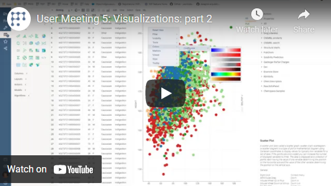

<!-- TITLE: Heatmap -->
<!-- SUBTITLE: -->

# Heatmap

Heatmap is a graphical representation of a table where each cell value is
color-coded. For numerical data, the higher values are colored red, and the
lower ones appear blue. The central value is assigned a light color so that
darker colors indicate a larger distance from the center. For categorical data,
each possible value is set to one color from a qualitative palette.

Heatmap displays more data in a smaller area. Use it to cross-examine
multivariate data and show the intensity and difference between variables.

PNG

>Note: Heatmap is based on [grid](grid.md), so you can apply all of the grid's
>features to it as well.

## Add a heatmap

1. Go to **Tables** and expand the **Viewers** panel.
1. Locate the **Heatmap** icon and click it.

Initially, the viewer displays a heatmap of the entire dataset on a screen.

## Configuring a heatmap

You can configure the data display detailing and customize a heatmap viewer. To
do that, click the **Gear** icon on top of the viewer and use settings on the
**Context Pane**. For example, you can:

* **Configure the data display detailing** using one of the following methods:
  * Set the desired row height under the **Row Height** setting.
  * On the viewer, configure vertical and horizontal range sliders.
* **Set whether to show all rows or the filtered ones only** by toggling the
  **Show Filtered Rows Only** checkbox.
* **Allow editing the data** by selecting the **Allow Edit** checkbox.
* **Switch between grid and heatmap modes** by toggling the **Is Grid**
  checkbox.

## Interaction with other viewers

Heatmap responds to the row selection and data filtering.

GIF

<!--## Viewer controls
 
|      Action                           |         Control             |
|-------------------------------------|-----------------------|
| Add node to selection           | Shift+click the node|
| Toggle node selection           | Ctrl+click the node |-->

## Videos

## See also

* [Grid](grid.md)
* [JS API: heatmap](https://public.datagrok.ai/js/samples/ui/viewers/types/heat-map)
