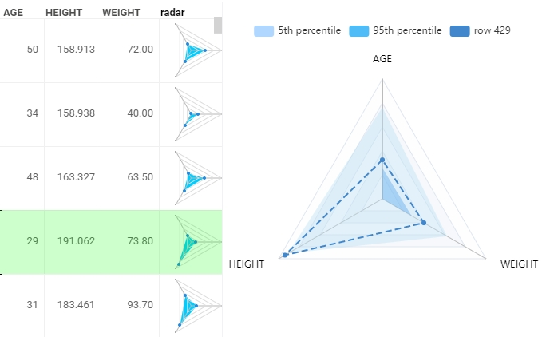
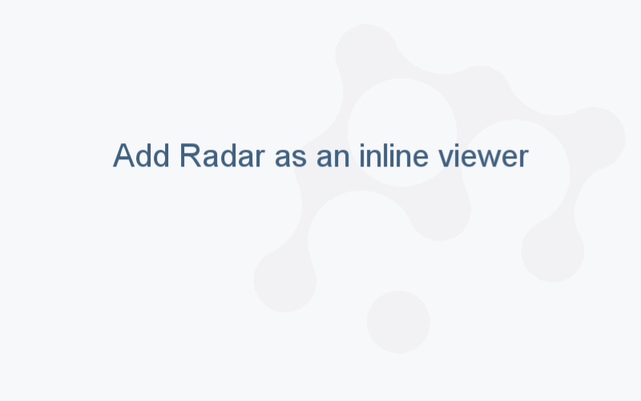

<!-- TITLE: Radar viewer -->
<!-- SUBTITLE: -->

# Radar viewer

Radar viewer (a spider chart) compares multivariate data across several quantitative dimensions. It plots numerical values of the table columns on axes that radiate out of a point: the higher value is, the further it is from the center. The values from the same table row are connected across axes with line segments.

On radar viewer, you can compare the numerical values of different columns within a row and rows’ values within a dataset. Radar viewer is commonly used in the comparison, decision-making, and analysis, for example, in [elemental analysis in cheminformatics](https://github.com/datagrok-ai/public/tree/master/packages/Chem#elemental-analysis).

You can use a radar viewer as a standalone chart or as an [inline viewer in summary column](grid.md#row-summary-columns) of the grid.

>Note: To use a radar viewer, install the package [Charts](https://github.com/datagrok-ai/public/tree/master/packages/Charts).

## Add a radar viewer

* As a standalone viewer:
  1. On the menu ribbon, click the **Add viewer** icon. A dialog opens.
  1. In the dialog, select **Radar viewer**.
* As an inline viewer:
  1. Right-click a grid. The context menu appears.
  1. Select **Add** > **Summary columns** > **Radar**.

When you add a standalone radar viewer, Datagrok chooses all numerical columns from the table (their number is limited to 20). For each column, it forms an axis and calculates the min and max percentiles (5th and 95th). As row values, percentiles are also connected across axes forming two color-filled areas.

## Configuring a radar viewer

To configure a radar viewer, click the **gear** icon on top of the viewer and use the **Misc** and **Color** info panels on the **Context Pane**.

For example, you can:

* Set the min and max percentiles by choosing their values from the dropdown lists in **Min** and **Max**.
* Toggle the display of percentiles using the **Show Min** and **Show Max** checkboxes.
* Set the background color for the percentiles’ areas using the **Background Min Color** and **Background Max Color** settings.
* Toggle value labels using the **Show values** checkbox.

## Interaction with other viewers

A radar viewer responds to the current row selection and doesn’t respond to data filters.

## See also

* [Viewers](../viewers.md)
* [PC plot](pc-plot.md)
* [Bar chart](bar-chart.md)
* Pie bar chart
* Sparkline
