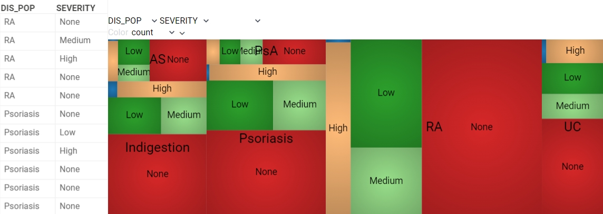

<!-- TITLE: Treemap -->
<!-- SUBTITLE: -->

# Treemap

Treemap displays hierarchical (tree-structured) data as nested rectangles. The
branches are rectangles, then tiled with smaller rectangles representing
sub-branches. A leaf nodes' rectangles have areas proportional to a specified
dimension of the data.

Treemap displays all data simultaneously and shows a part-to-whole relationship
among many categories. Use a treemap to spot irregularities or patterns, for
example, in sales data.

## Add a treemap

1. Go to **Tables** and expand the **Viewers** panel.
1. Locate the **Treemap** icon and click it.

Initially, the viewer picks up the first categorical column in the corresponding
table and builds a treemap.

## Configuring a treemap

You can set the hierarchy and customize a treemap viewer. To do that, click the
**Gear** icon on top of the viewer and use settings on the **Context Pane**. For
example, you can:

* **Set tree hierarchy**. Add and delete new levels or change their order using
  one of the following methods:
  * Select the desired columns using the checkboxes provided under the **Split
    by** setting.
  * On the top of the viewer, on the **Column Selection Panel**, select the
    desired columns from the dropdown lists.
* **Select the rows for the treemap display** using the **Row source** dropdown
  list.
* **Size-code nodes**. Select a column for aggregation and an aggregation
  function using the **Size**  and **Size Aggr Type** settings.
* **Color-code nodes**. Select a column for aggregation and an aggregation
  function using the **Color** and **Color Aggr Type** settings.
* **Toggle visibility of Column Selection Panel** via the **Show Column
  Selection Panel** checkbox.

## Interaction with other viewers

A treemap viewer responds to the rows selection and data filtering.

## Viewer controls

|      Action                           |         Control             |
|-------------------------------------|-----------------------|
| Add node to selection           | Shift+click the node|
| Toggle node selection           | Ctrl+click the node |

## Videos

## See also

* [Viewers](../viewers.md)
* [Table view](../../datagrok/table-view.md)
* [JS API: Tree map](https://public.datagrok.ai/js/samples/ui/viewers/types/tree-map)
