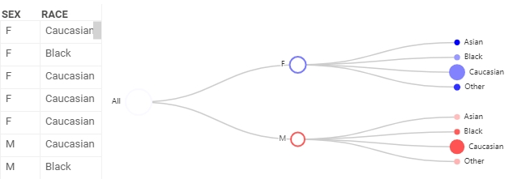

# Tree viewer

The tree viewer shows the hierarchical structure of categorical data. It groups dataset rows into nodes by categories in columns. In this case, each column forms a new hierarchy level.

Common uses:

* An organizational chart
* Sales by location

## Create a tree viewer

1. On the menu ribbon, click the **Add viewer** icon. A dialog opens.
1. In the dialog, select **Tree viewer** and click OK.

When you add the viewer, Datagrok automatically detects two categorical columns with the least number of categories. They form the initial hierarchy of the tree chart.  

## Manage the viewer settings

You can set the tree hierarchy and customize the viewer. To do that, click the **gear** icon on top of the viewer and use the **Data** and **Misc** info panels on the **Context Pane** to manage the tree viewer settings.

For example, you can:

* **Set the tree hierarchy**. Add and delete new levels or change their order using the **Hierarchy** setting.
* **Size-code the nodes**. Define a column for aggregation in **Size** and select an aggregation function in **Size Aggr Type**.
* **Color-code the nodes** using **Color Aggr Type** and **Color** settings.
* **Expand and collapse** the whole tree hierarchy by switching **Expand and Collapse**.
* **Change the number of levels** the viewer automatically collapses to by setting the **Initial Tree Depth** value.
* **Customize the tree viewer** by setting the tree **Layout** as either `orthogonal` or `radial`. And for `orthogonal` layout, you can also:
  * Define the tree **direction** using the **Orient** setting.
  * Change the **shape of the branches** in the **Edge Shape** setting.

GIF

## Viewer controls

|      Action                           |         Control             |
|-------------------------------------|-----------------------|
| Expand/collapse branch        |Node: click   |
| Add node to selection           | Node: shift+click|
| Toggle node selection           |  Node: ctrl+click |

## See also

* [Viewers](../viewers.md)
* Network viewer
* BiostructureViewer
* PhyloTreeViewer
