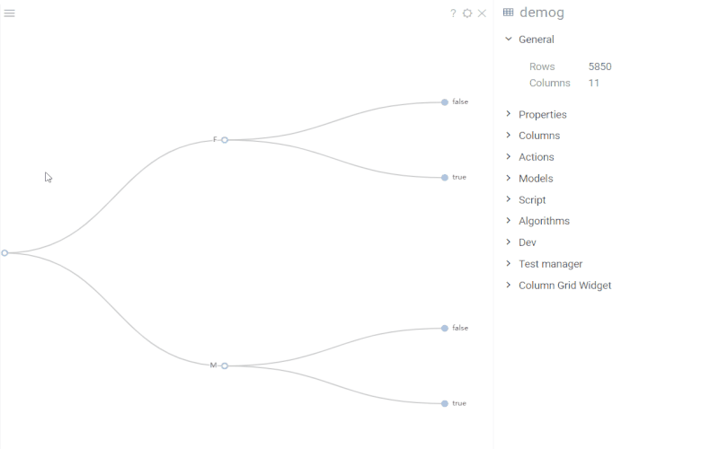

# Tree viewer

Tree viewer visualizes hierarchical data. Initially, the chart builds a tree
structure for a given dataset with up to three levels. To form a hierarchy, the
viewer selects columns with the least number of categories. Each category
corresponds to a node.

To apply tree viewer for a given dataset, on the menu ribbon, click **Add
viewer** icon and select **Tree viewer** in the opend window.

## Properties

To change the order of columns, add new levels to the initial hierarchy or
remove the existing ones, edit the viewer's **Hierarchy** property. Also, in the
viewer properties, you can adjust marker settings, change a tree layout, or
toggle certain behaviors, such as animation, expanding or collapsing nodes, etc.

To learn more about viewers' properties, see
[Properties](../viewers.md#properties).

## Actions

|                     |                        |
|---------------------|------------------------|
| Node: click         | Expand/collapse branch |
| Node: ctrl+click    | Invert node selection  |
| Node: shift+click   | Add node to selection  |

For the complete list of actions, see
[**Common actions**](../viewers.md#common-actions)

See also:

* [Viewers](../viewers.md)
