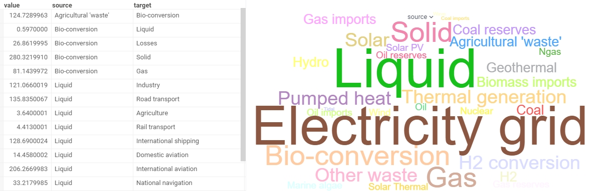

<!-- TITLE: Word cloud -->
<!-- SUBTITLE: -->

# Word cloud

Word cloud (a tag cloud) shows frequency of individual words from a table column with font size and color. Use it to see the most popular concepts, highlight important textual data points, compare data, etc.

## Add a word cloud

1. Go to **Tables** and expand the **Viewers** panel.
1. Locate the **Word Cloud** icon and click it.

Initially, the viewer picks up the first string column in the corresponding table and builds a word cloud.

## Configuring a word cloud

To configure a word cloud, click the **Gear** icon on top of the viewer and use the info panels on the **Context Pane**. For example, you can:

* **Select the column for displaying a word cloud** from the dropdown list under the **Word** setting.
* **Size-code words**. Define a column for aggregation using the **Size** and select an
  aggregation function under the **Size Column Aggr Type** settings.
* **Color-code words**. Define a column for aggregation using the**Color** and select
  an aggregation function under the **Color Column Aggr Type** settings.
* **Set min and max font sizes** using the **Min Size** and **Max size** settings.
* **Limit the number of words to appear in a cloud** using the **Max Words** setting.
* **Set the background color** using the **Back Color** setting.

## Interaction with other viewers

A word cloud viewer doesn’t respond to the row selection and data filtering. You can use it to filter other viewers.

## See also

* [Viewers](../viewers.md)
* [Table View](../../datagrok/table-view.md)
* [JS API: Word cloud](https://public.datagrok.ai/js/samples/ui/viewers/types/word-cloud)
